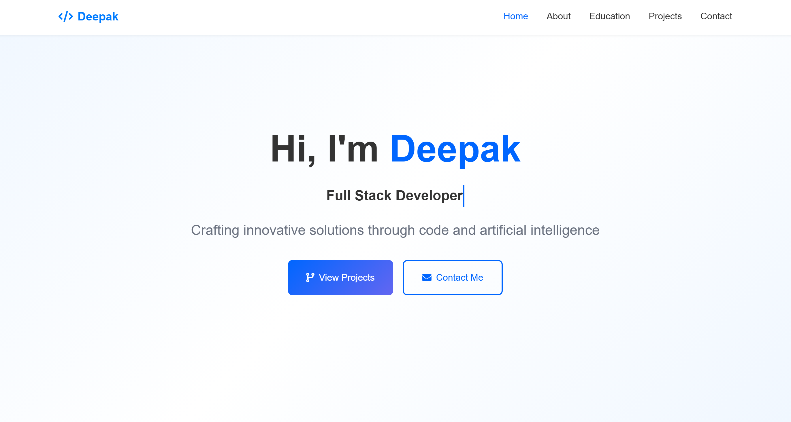

# 🚀 Modern Software Developer Portfolio



<div align="center">
  
  
  
  
  
</div>

## ✨ Features

### 🏠 Home Page

- Modern hero section with gradient background
- Interactive skills cards with hover effects
- Real-time statistics counter
- Smooth scroll animations
- Responsive navigation

### 👤 About Page

- Professional bio with profile image
- Animated skill progress bars
- Downloadable resume
- Skill categories:
  - Frontend Development
  - Backend Development
  - AI/ML
  - Tools & Technologies

### 📚 Education Page

- Interactive timeline for education history
- Modern certification cards
- Professional experience showcase
- Smooth animations and transitions

### 💼 Projects Page

- Dynamic project filtering system
- Categories: Web, AI/ML, Mobile, Cloud
- Interactive project cards with:
  - Image preview with zoom effect
  - Technology tags
  - Project description
  - Live demo & source code links

### 📞 Contact Page

- Modern contact form with validation
- Interactive Google Maps integration
- Social media connection cards
- Professional contact information display

## 🛠️ Technologies Used

- **Frontend**

  - HTML5
  - CSS3 (Custom Variables, Flexbox, Grid)
  - JavaScript (ES6+)

- **Libraries & Frameworks**

  - Three.js (3D Effects)
  - GSAP (Animations)
  - AOS (Animate On Scroll)
  - Font Awesome Icons

- **Tools & Utilities**
  - Git & GitHub
  - VS Code
  - npm

## 🎨 Design Features

- Responsive design for all devices
- Custom color scheme with CSS variables
- Modern gradient backgrounds
- Card-based layouts
- Consistent typography
- Professional spacing
- Smooth animations
- Interactive elements

## 📁 Project Structure

```
software-engineer-portfolio/
├── index.html              # Home page
├── about.html             # About & Skills page
├── education.html         # Education & Experience page
├── projects.html          # Projects showcase page
├── contact.html          # Contact form & info page
├── css/
│   ├── style.css         # Main styles
│   └── cursor.css        # Custom cursor styles
├── js/
│   ├── main.js           # Main JavaScript
│   ├── cursor.js         # Cursor animations
│   └── three-animation.js # 3D effects
└── assets/               # Images and other assets
```

## 🚀 Getting Started

1. **Clone the repository**

   ```bash
   git clone https://github.com/phoenixdev100/software-engineer-portfolio.git
   ```

2. **Navigate to the project directory**

   ```bash
   cd software-engineer-portfolio
   ```

3. **Open in browser**
   - Open `index.html` in your preferred browser
   - Or use a local development server:
     ```bash
     npx serve
     ```

## 💻 Development

1. **Prerequisites**

   - Basic knowledge of HTML, CSS, and JavaScript
   - Code editor (VS Code recommended)
   - Git for version control

2. **Making Changes**

   - Edit HTML files for content changes
   - Modify CSS in `css/style.css` for styling
   - Update JavaScript in `js/` directory for functionality

3. **Testing**
   - Test on multiple browsers
   - Check responsive design using DevTools
   - Validate HTML and CSS

## 🎯 Future Enhancements

- [ ] Dark mode toggle
- [ ] Blog section integration
- [ ] Project filter animations
- [ ] More interactive 3D elements
- [ ] Performance optimization
- [ ] Accessibility improvements

## 📄 License

This project is licensed under the MIT License - see the [LICENSE](LICENSE) file for details.

## 🤝 Contributing

1. Fork the repository
2. Create your feature branch (`git checkout -b feature/AmazingFeature`)
3. Commit your changes (`git commit -m 'Add some AmazingFeature'`)
4. Push to the branch (`git push origin feature/AmazingFeature`)
5. Open a Pull Request

## 📬 Contact

Deepak - [support@phoenixdev100.tech](mailto:support@phoenixdev100.tech)

Project Link: [https://github.com/yourusername/software-engineer-portfolio](https://github.com/phoenixdev100/software-engineer-portfolio)

---

<div align="center">
  Made with ❤️ by Deepak
</div>
